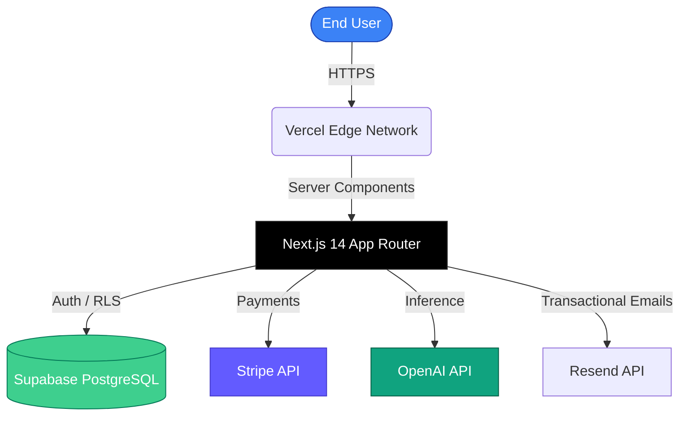

# 🚀 Next.js 14 AI SaaS Boilerplate

<div align="center">


**The ultimate production-ready starter kit for building your next highly profitable AI Software-as-a-Service.**

[](https://nextjs.org/)
[](https://openai.com/)
[](https://stripe.com/)
[](https://supabase.com/)
[](https://prisma.io/)

[Live Demo](#) • [Documentation](#) • [Deploy to Vercel](#)

</div>

---

## 🎯 What's Included?

Forget spending weeks setting up authentication, databases, and billing. This boilerplate gives you:

- ⚛️ **Next.js 14** (App Router, React Server Components)
- 🔐 **Authentication** (Magic Links, Social Logins via Supabase)
- 💳 **Billing/Subscriptions** (Stripe Checkouts & Customer Portal)
- 🤖 **AI Integration** (OpenAI streaming API out-of-the-box)
- 🗄️ **Database** (PostgreSQL with Prisma ORM)
- 🎨 **Styling** (Tailwind CSS, Shadcn UI)
- ✉️ **Emails** (Resend & React Email)

---

## 🏗️ Architecture



---

## 🖥️ Dashboard Preview

<div align="center">
  
</div>

---

## 🚦 Getting Started

### 1. Clone & Install

```bash
git clone https://github.com/razinahmed/nextjs-ai-saas-boilerplate.git
cd nextjs-ai-saas-boilerplate
npm install
```

### 2. Environment Variables

Rename `.env.example` to `.env.local` and fill in your keys:

```env
# NextJS
NEXT_PUBLIC_APP_URL="http://localhost:3000"

# Supabase
NEXT_PUBLIC_SUPABASE_URL="..."
NEXT_PUBLIC_SUPABASE_ANON_KEY="..."

# Stripe
STRIPE_API_KEY="..."
STRIPE_WEBHOOK_SECRET="..."
NEXT_PUBLIC_STRIPE_PRO_PRICE_ID="..."

# OpenAI
OPENAI_API_KEY="..."
```

### 3. Database Setup

```bash
npx prisma generate
npx prisma db push
```

### 4. Run Development Server

```bash
npm run dev
```
Open [http://localhost:3000](http://localhost:3000) with your browser to see the result.

---

## 💡 AI Features Included

1. **AI Chat Interface**: A beautiful streaming UI similar to ChatGPT.
2. **Text Summarization Endpoint**: Ready-to-use API route for summarizing content.
3. **Image Generation**: DALL-E 3 integration route built-in.
4. **Token Tracking**: Middleware that tracks user token usage and limits access based on their Stripe subscription tier.

---

## 🛡️ License

This boilerplate is completely open-source under the **MIT License**. Build your dream startup without any commercial restrictions.

---

<div align="center">
  <h3>Built by <a href="https://github.com/razinahmed">Abdul Rasak V</a></h3>
  <p>⭐ If this saves you time, please give it a star!</p>
</div>
